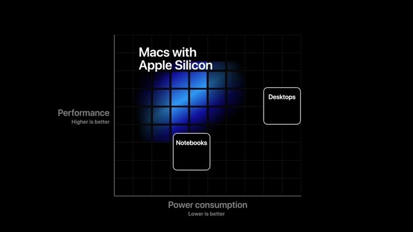
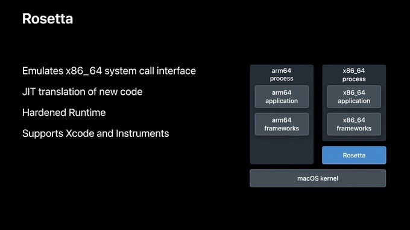
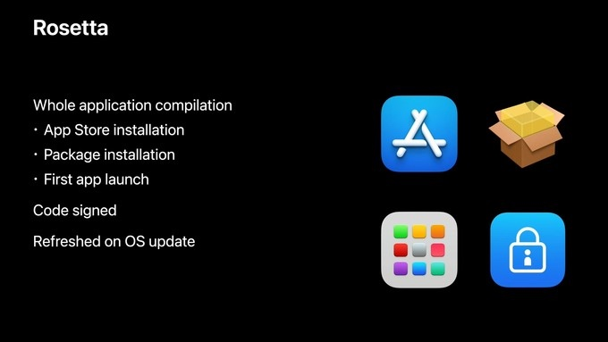
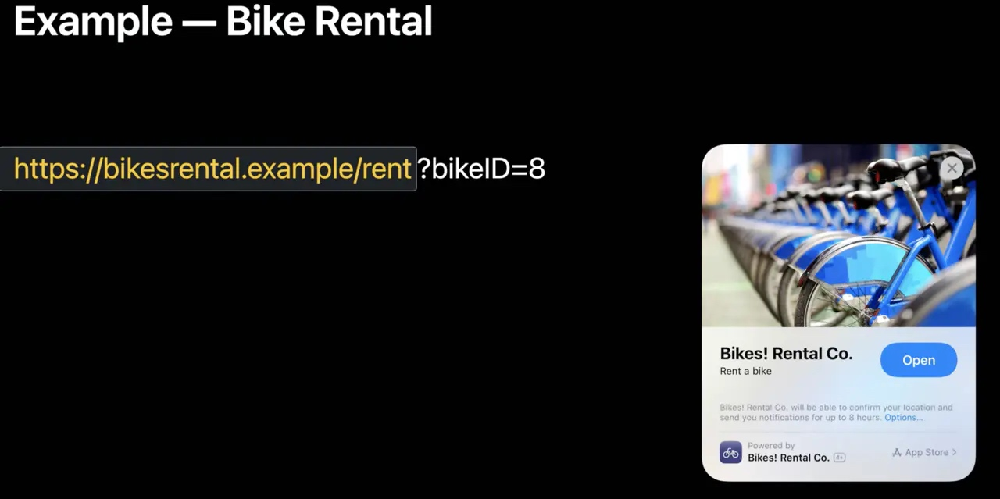

# WWDC20
## 0x01：Mac on ARM - Apple Silicon
从IBM的PowerPC到Intel，从Intel到ARM。
### 更高的能效比，更高的性能

### 整个生态系统使用同一个通用架构 - Universal Apple Platform
将用ARM完成大一统，完成之前微软想做而又做不到的事情。
[https://post.smzdm.com/p/a830dnl6/](https://post.smzdm.com/p/a830dnl6/)

### 相关技术支持：
- [Project Catalyst](https://developer.apple.com/documentation/uikit/mac_catalyst)
Adapt your iPad app for Mac Catalyst
- SwiftUI
- Rosetta 2

- Universal Binary
- 未来 ARM 架构的 Mac 将不支持 Boot Camp

### 未来
> 苹果现在做的是一种生态系统，提供全家桶式的优质体验，这需要对软硬件产品都有绝对的控制权。纵观苹果的整个产品线，现在只剩下Mac的核心配件还在受制于人，那么，换芯这件事情就是必然会发生的了。同时，通过换芯，苹果可以打造出更加完美的硬件生态环境，继续打通不同形态设备之间的隔阂，用一致连贯的体验征服更多的用户，这是为将来更好的发展而打基础的事情，值得公司用一条知名产品线去冒这个风险。未来的Mac，将会更加融入目前的苹果全家桶。

## 0x02：App Clips
类似微信小程序

https://juejin.im/post/5ef41c9b6fb9a07e6143b0d0#heading-6

[Explore app clips](https://developer.apple.com/videos/play/wwdc2020/10174/)
[Configure and link your app clips](https://developer.apple.com/videos/play/wwdc2020/10146/)

### 用完即走，触手可得（lightweight、native、fast、focused、in-the-moment）
- 不能超过10MB
- 遵从 universal link（使用一段 URL 标识自己）

- 只能是用户主动要发起才能访问
- 发起入口
    - 通过 NFC
    - Safari 中关联了Clip的网页
    - Siri 附近建议和苹果地图（connect中可以配置clip的地理位置）
    - 通过 iMessage
    - 通过扫码（苹果专属的Clip码生成工具年底才会开放）
- 生命周期系统管理
- 可以共享 Asset catalog 来共用图片资源。
- 在 Clip 中申请的授权，在下载完整应用后会被同步到应用中。 通过 App Group Container 来共享 clip 和 app 的数据。
- 在 App Store connect 中还可以针对指定的参数配置不一样的标题和图片。
- App Clips导流到主应用,为了进一步提高App Clip到主App的转化，在使用App Clip的过程中，Apple也会明显提示主App的存在，方便用户直接去下载
- 30天不使用，系统自动删除App Clip及数据，来确保用户的存储空间能够合理分配。
- 支持地理位置，相机，麦克风和蓝牙等权限，限制访问 Health、Fitness、通讯录、信息、照片、文件等个人数据。
- 设计了免申请的通知、定位权限。当然还是有限制，免申请的通知只在 8 个小时内有效，地理位置只能获取一次。
- 支持Sign in with Apple，也支持ASWebAuthenticationSession来第三方登录，以及使用Apple Pay。
- 不会与App一起出现在用户的Setting App里，有单独的App Clips的分组。
- 一旦安装了主App，对应的App Clip将会被删除，再点击链接将会直接进入主App。
- 主工程支持多个App Clip Target

**引导转化** - SKOverlay
Apple建议开发者可以在App Clip的视图中嵌入SKOverlay，当用户在App Clip中完成相关任务后展示SKOverlay，这样可以较好的引导用户，比如可以将其放置在用户的付款确认界面之后。
SKOverlay也是新特性，这里就不展开说了，详细请参考https://developer.apple.com/videos/play/wwdc2020/10661/

**如何处理Universal Link和App Clip URL？**
官方Demo提供的解决方案是通过编译宏APPCLIP来做分支处理，这样能够最大程度共用代码：
import SwiftUI

#if APPCLIP
import AppClip
import CoreLocation
#endif

@main
struct FrutaApp: App {
    @StateObject private var model = FrutaModel()

    #if !APPCLIP
    @StateObject private var store = Store()
    #endif

    @SceneBuilder var body: some Scene {
        WindowGroup {
            #if APPCLIP
            NavigationView {
                SmoothieMenu()
            }
            .environmentObject(model)
            .onContinueUserActivity(NSUserActivityTypeBrowsingWeb, perform: handleUserActivity)
            #else
            ContentView()
                .environmentObject(model)
                .environmentObject(store)
            #endif
        }
    }

    #if APPCLIP
    func handleUserActivity(_ userActivity: NSUserActivity) {
        guard let incomingURL = userActivity.webpageURL,
              let components = NSURLComponents(url: incomingURL, resolvingAgainstBaseURL: true),
              let queryItems = components.queryItems else {
            return
        }
        if let smoothieID = queryItems.first(where: { $0.name == "smoothie" })?.value {
            model.selectSmoothie(id: smoothieID)
        }
        guard let payload = userActivity.appClipActivationPayload,
              let latitudeValue = queryItems.first(where: { $0.name == "latitude" })?.value,
              let longitudeValue = queryItems.first(where: { $0.name == "longitude" })?.value,
              let latitude = Double(latitudeValue), let longitude = Double(longitudeValue) else {
            return
        }
        let region = CLCircularRegion(center: CLLocationCoordinate2D(latitude: latitude,
                            longitude: longitude), radius: 100, identifier: "smoothie_location")
        payload.confirmAcquired(in: region) { inRegion, error in
            if let error = error {
                print(error.localizedDescription)
                return
            }
            DispatchQueue.main.async {
                model.applePayAllowed = inRegion
            }
        }
    }
    #endif
}
复制代码其中handleUserActivity就是在处理App Clip链接。
当然，直接将主App和App Clip的代码分开也是可以的，但是这可能对于两者区别较大的产品更适合，但同时也违反了Apple的初衷，希望App Clip仅仅是主App的一部分，这可能会导致审核遇阻。

 
### 与PWA、Instant Apps、小程序 
**PWA：**
渐进式增强WEB应用， 是Google 在2016年提出的概念，2017年落地的web技术。
目的就是对标原生app，将Web网站通过一系列的Web技术去优化它，提升其安全性，性能，流畅性，用户体验等各方面指标，最后达到用户就像在用app一样的感觉。
相当于把小程序里的代码直接下载到了本地

**Instant Apps：**
在 Google I/O 2016 上，Google 就公布了 Instant Apps 这项技术，它让人们无需安装也能享受 app 带来的服务。2018年正式发布

所以入口上不支持二维码、NFC。 两者的根本区别还是在定位上，Instant apps 提出的场景是提供一个 app 的试用版。

**小程序**
在市场上(尤其中国)，小程序是 Clip 的真正对手。
小程序基于微信的 app，Clip 基于操作系统，因此在`能力上 Clip 有优势`。小程序的入口需要先打开微信，而 Clip 可以通过 NFC 靠近直接激活应用。对于开发者而言，Clip 可以直接获得很多`原生的能力（比如 push）`，如果用户喜欢可以关联下载自己的原生应用。在小程序中，微信出于商业原因开发者不能直接跳转到自有 app，小程序的能力也`依赖于微信提供的接口`。
对于从 Clip 关联主 app 苹果还挺重视的，提供了几个入口展示关联 app。

入口不同：App Clip支持多种打开方式，微信小程序只支持从微信进入，但是后者支持主动搜索。
性能不同：App Clip依赖于系统，微信小程序依赖于微信，原生性能会明显优于小程序。
体验路径不同：微信小程序需要打开微信，下拉小程序列表，找到并打开目标小程序，App Clip一步到位，实施降维打击。
定位不同：App Clip明确是主App功能的一部分，不能做主App无关的内容，但是微信小程序没有该限制，并且支持独立发布。

### 与原生APP比较
Clip 可以直接使用 iOS framework

App 不能访问用户的隐私信息：

    运动和健身数据
    Apple Music 和多媒体文件
    通讯录、信息、照片、文件等数据
    
能够提供给用户更加轻便的体验，通过专门为 Clip 设计了免申请的通知、定位权限。不过也有限制：免申请的通知只在 8 个小时内有效。位置只能获取一次。如果 app 需要重度使用这两类权限就还是和原来一样，可以弹窗申请。
某些高级应用能力也会受限，需要在完整的应用中才能使用：

    不能请求追踪授权
    不能进行后台请求任务
    没在激活状态蓝牙连接会断开

## 0x03： 桌面小组件 Widgets & App Lib 
[Meet WidgetKit](https://developer.apple.com/videos/play/wwdc2020/10028/)
https://www.jianshu.com/p/0b6622543855

### iOS 14：小组件+App资源库打造全新交互方式 ：https://www.sohu.com/a/405175726_115831?_trans_=000019_hao123_nba

## Apple与汽车
[Introducing Car Keys](https://developer.apple.com/videos/play/wwdc2020/10006/)
[Accelerate your app with CarPlay](https://developer.apple.com/videos/play/wwdc2020/10635/)

车门解锁、落锁、启动、远程控制、共享等功能。
智能手机和汽车会有更深度的融合，短暂的遥控驾驶？

## 0x04：macOS 11: Big Sur

## 0x05：人体关键点检测技术
## 0x06: PhotoLibr
## 0x07: 一些优化
### UICollectionView
Create better collection views

https://www.jianshu.com/p/e8843595a794
### [Runtime](https://developer.apple.com/videos/play/wwdc2020/10163/)

## 其他
https://www.sohu.com/a/405175726_115831?_trans_=000019_hao123_nba
https://www.bilibili.com/read/cv6511002

### iOS 14 SwiftUI中的新增功能
https://developer.apple.com/videos/play/wwdc2020/10119/
https://juejin.im/post/5efc2f906fb9a07e66233fed

## 机器学习
What's new in Machine Learning and Computer Vision

## What's new in PhotoKit

## Explore modern networking

## Explore HLS streaming
## Advancements in AVFoundation
## Create apps for a global audience
## Improve performance and battery life in your app
## https://www.ershicimi.com/p/222204569ee64de348bd589a9efdfa7c

## Xcode 12
-  添加了对可缩放矢量图形（SVG）图像资产的支持

## Swift 5.3 新特性