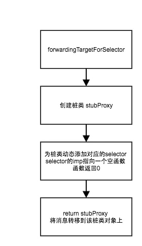
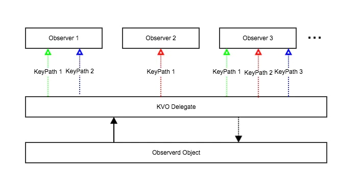
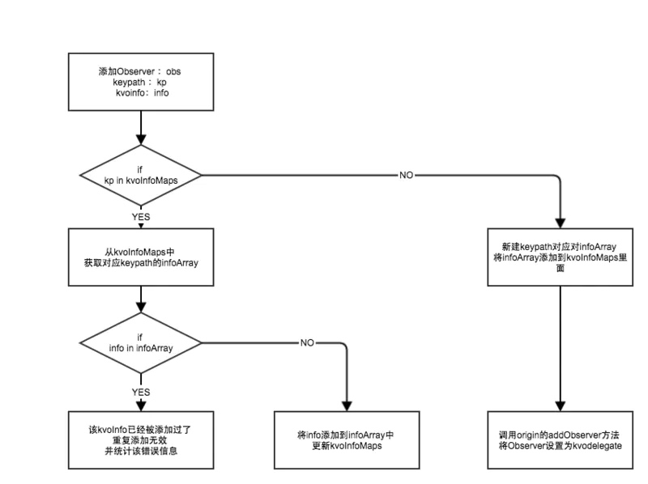

# OOM
#  工具
- Instruments
- FBRetainCycleDetector
- Xcode 8 推出的 Memory Graph
- MLeaksFinder

[OOM分析](https://www.cnblogs.com/kenshincui/archive/2020/06/17/13153681.html)

[网易crash防护](https://juejin.im/entry/58989d162f301e00691b6968)

# 造成OOM的原因
- Jetsam
[Low Memory Reports](https://developer.apple.com/library/archive/technotes/tn2151/_index.html)
[XNU源码](https://opensource.apple.com/source/xnu/)
[核心代码](https://opensource.apple.com/source/xnu/xnu-3789.70.16/bsd/kern/kern_memorystatus.c.auto.html)

## 内存泄漏
被持久占用无法释放
工具 - Leaks & Memory Graph

> Leaks 只能检测出 Leaked memory
[Instrument-Abandoned Memory](https://help.apple.com/instruments/mac/11.0/index.html?localePath=en.lproj#/dev7b8f6eb6)

## 常见问题
### 找不到方法的实现unrecognized selector sent to instance
- 代理没有实现 （optional、responsForSelector）
- 可变属性使用copy
- 使用高版本API（即不存在的API）
- 解决办法

> 1. 实现消息转发几个步骤
> 2. 尽量避免使用performSelector一系列方法
> 3. 保持.h 的干净
> 4. 可变避免copy、版本处理
> 

### KVO crash

