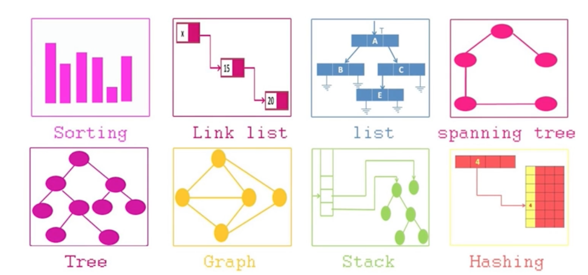
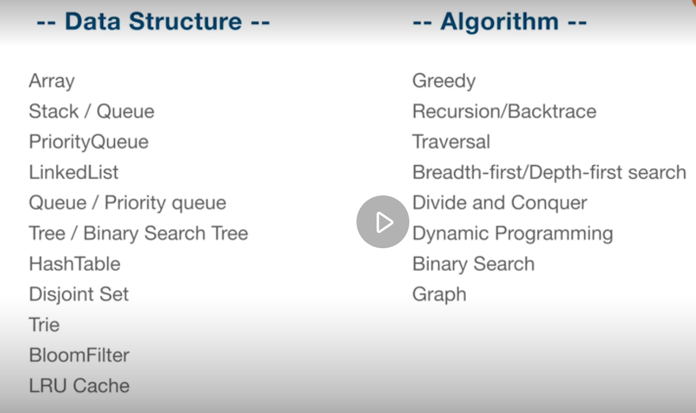

# 算法刻意练习
切碎知识点
刻意练习
反馈

chut up






刻意练习


# 两数之和
## Python

```
Class Solution:
    def twoSum(nums, target):
        hash_map = dict()
        for i, x in enumerate(nums):
            if target - x in hash_map:
                return [i, hash_map[target - x]]
            hash_map[x] = i 
```